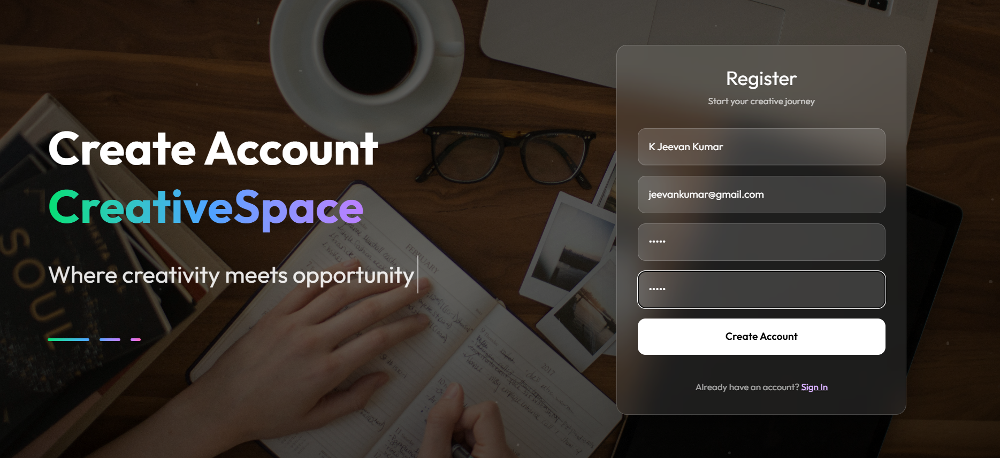
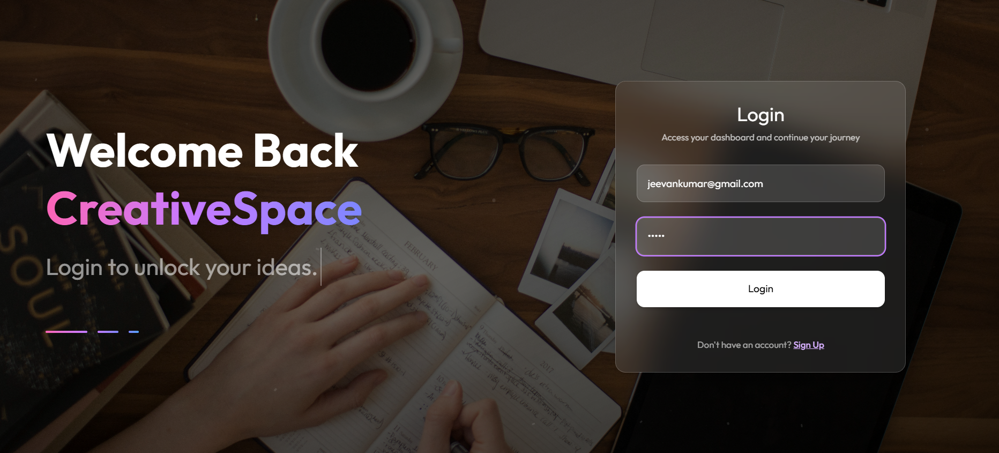
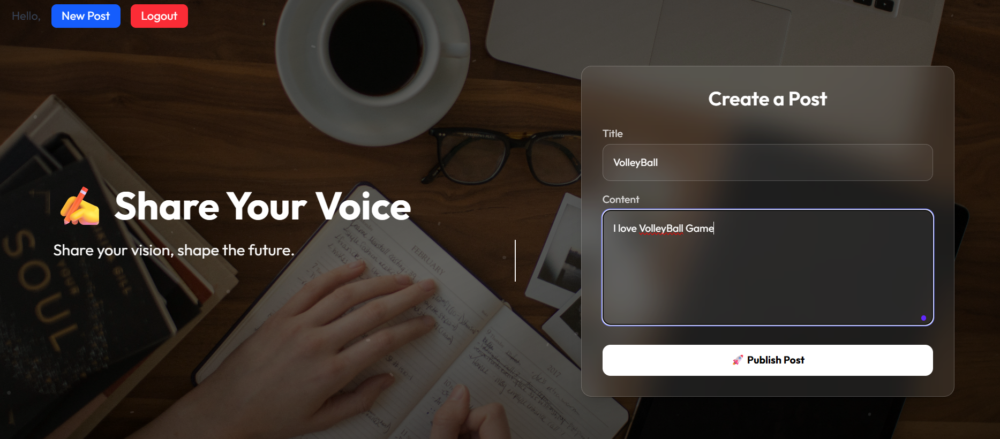
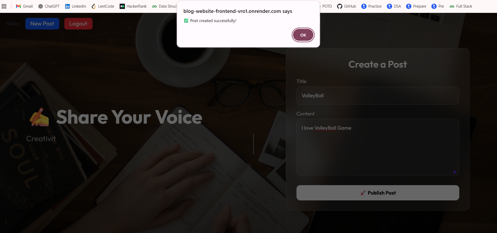
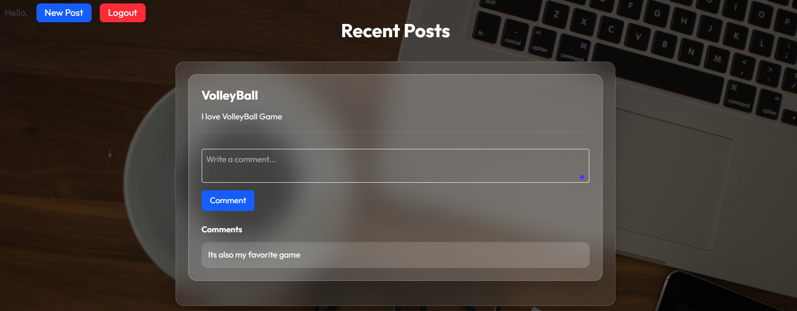

# 📝 Blog Website - MERN Stack

### 👨‍🎓 **Project By :**  
**K Jeevan Kumar**  
🎓 **Final Year, Computer Science & Engineering**  
🏫 **Alva's Institute of Engineering & Technology**  
🆔 **USN: 4AL22CS067**

---

## 📌 Table of Contents  

| Section | Description |
|---------|-------------|
| [📌 Overview](#-overview) | Project Introduction & Features |
| [🛠️ Tech Stack](#️-tech-stack) | Frontend & Backend Technologies Used |
| [📂 Project Structure](#-project-structure) | Folder Structure of the Project |
| [🖼️ Results](#️-results) | Screenshots of Application Pages |

---

## 📌 Overview  
The **Blog Website** is a full-stack blogging platform where users can **register**, **login**, **create blog posts**, and **comment** on others' posts. The application features modern UI with Tailwind CSS and secure backend authentication using JWT tokens.

### ✨ Key Features:
✅ **User Authentication** – Register/Login using JWT  
✅ **Create, Read & Delete Posts** – Blog post management  
✅ **Commenting System** – Readers can add comments  
✅ **Responsive UI** – Works on all screen sizes  
✅ **Typewriter Hero Section** – Motivational animated quotes

---

## 🛠️ Tech Stack

### Frontend  
- ⚛️ **React.js (with Vite)** – Lightning-fast development  
- 🎨 **Tailwind CSS** – Utility-first modern styling  
- 💫 **Framer Motion** – Smooth animations  
- 🌐 **Axios** – API communication

### Backend  
- 🟢 **Node.js with Express** – RESTful APIs  
- 🌿 **MongoDB** – NoSQL database  
- 🧩 **Mongoose** – MongoDB ODM  
- 🔐 **JWT (JSON Web Token)** – Authentication  
- 🧰 **dotenv** – Secure environment variables

---

## 📂 Project Structure

```bash
BlogWebsite/
├── client/                          # React frontend
│   ├── src/
│   │   ├── pages/                   # Home, Login, Register, CreatePost, Profile
│   │   ├── components/              # Navbar, Hero, PostList, PostItem, CommentList, CommentForm
│   │   ├── context/                 # AuthContext
│   │   ├── services/                # API services (auth, post, comment)
│   │   └── assets/screenshots/      # Project screenshots
│   └── public/                      # Static files
│
├── server/                          # Express backend
│   ├── models/                      # User, Post, Comment schemas
│   ├── controllers/                 # Logic for auth, post, comment
│   ├── routes/                      # API route handlers
│   ├── middleware/                  # JWT auth middleware
│   └── config/                      # DB connection
│
├── .env                             # Environment variables
├── package.json                     # Project metadata and scripts
└── README.md                        # Documentation
```

## 🖼️ Results

---

### 🏡 1. Home Page  
  
<p align="left">🌐 <i>The <b>Home Page</b> showcases the latest blog posts along with navigation options for users to Register or Login.</i></p>  

---

### 📝 2. User Registration  
  
<p align="left">🧾 <i>New users can register with their <b>Name, Email, Password, and Confirm Password</b>. The page also includes a dynamic Hero section with animated motivational quotes.</i></p>  

---

### 🔐 3. User Login  
  
<p align="left">🔓 <i>Registered users can securely log in using their <b>Email and Password</b>.</i></p>  

---

### ✍️ 4. Create Blog Post  
  
<p align="left">📝 <i>Users can create a new blog post by entering the <b>Title</b> and <b>Content</b>.</i></p>  

---

### 📤 5. Post Published  
  
<p align="left">📌 <i>Once submitted, the user's post is displayed along with others on the platform.</i></p>  

---

### 💬 6. View Comments on Posts  
  
<p align="left">💡 <i>Users can read recent posts and actively engage by <b>adding comments</b> on blog posts.</i></p>  

---

> ✅ All pages are fully responsive and styled using Tailwind CSS for a modern, clean look.
---
